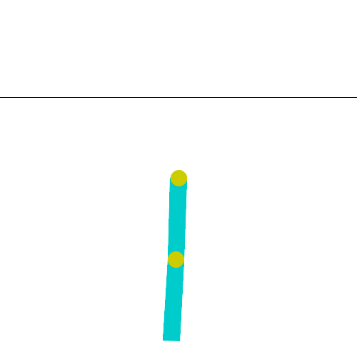

# **Action Selection Strategy Heuristics** for **Acrobot**

#### **Problem** 
The Acrobot problem is a well-known reinforcement learning task in OpenAI Gym, where the objective is to minimize iterations needed to swing a two-link chain system's free end above a target height by applying torque to the actuated joint within specified angular constraints.


+ **Given:** 
1. A acrobot. The system consists of two links connected linearly to form a chain, with one end of the chain fixed. The joint between the two links is actuated.
2. theta1 is the angle of the first joint, where an angle of 0 indicates the first link is pointing directly downwards.
3. theta2 is relative to the angle of the first link. An angle of 0 corresponds to having the same angle between the two links.


+ **Objective:** Minimize the total number of iterations required to apply torques on the actuated joint to swing the free end of the linear chain above a specified height.

+ **Constraints:** 
    - The angular velocity of theta1 is between (-12.567, 12.567).
    - The angular velocity of theta2 is between (-28.274, 28.274).
    - The possible actions are:
        1. Apply -1 torque on actuated  joint.
        2. Apply 0 torque on actuated joint
        3. Apply +1 torque on actuated joint.


#### Algorithm Design Task

+ **Action selection strategy heuristics:** Push the actuated joint to swing the free end of the linear chain above a specified height **The task** is to design the heuristic for selecting the action in each iteration.
  + **Inputs:** Cosine of theta1, sine of theta1, cosine of theta2, sine of theta2, angular velocity of theta1, angular. velocity of theta2, last selected action
  + **Outputs:** Next action.

#### Evaluation

+ **Dataset:** Each designed algorithm is evaluated on gym environment. 

+ **Fitness:** 
    - If the free end can't reach the specific height within the iteration limit: `cos(theta1) + cos(theta1 + theta2) + 2`, where 2 is bias.
    - If the free end reach the specific height within the iteration limit: `final_iteration / max_iteration`.

#### Template: 

```python
template_program = '''
import numpy as np
def choose_action(ct1: float, st1: float, ct2: float, st2: float, avt1: float, avt2: float, last_action: int) -> int: 
    """
    Design a novel algorithm to select the action in each step.

    Args:
        ct1: cosine of theta1, float between [-1, 1].
        st1: sine of theta1, float between [-1, 1]
        ct2: cosine of theta2, float between [-1, 1].
        st2: sine of theta2, float between [-1, 1].
        avt1: angular velocity of theta1, float between [-12.567, 12.567].
        avt2: angular velocity of theta2, float between [-28.274, 28.274].


    Return:
         An integer representing the selected action for the acrobot.
         0: apply -1 torque on actuated  joint.
         1: apply 0 torque on actuated joint
         2: apply +1 torque on actuated joint.

    """
    # this is a placehold, replace it with your algorithm
    action =  np.random.randint(3)

    return action
'''

task_description = "I need help designing an innovative heuristic strategy function to control an acrobot, aiming to swing the lower link to generate enough momentum for the upper link to reach a target height. At each step, the function should select a specific action based on the acrobot's joint angles and angular velocities to efficiently reach the goal without unnecessary oscillations or excessive control effort."


```

