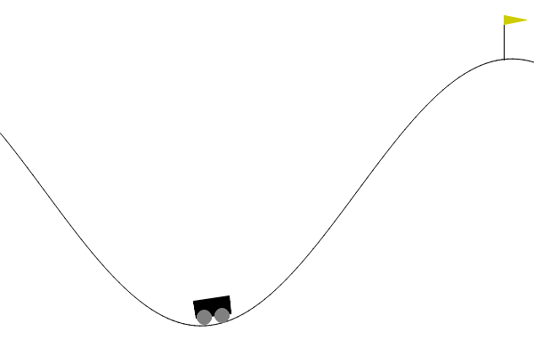

# **Action Selection Strategy Heuristics** for **Mountain Car**

#### **Problem** 

The Mountain Car problem is a foundational reinforcement learning problem in OpenAI Gym, where the goal is to optimize the car's actions to reach a target with minimal iterations under specific position and velocity constraints.


+ **Given:** A car with its position uniformly randomly assigned within the range [-0.6, -0.4], a landscape, and a target marked by a flag.

+ **Objective:** Minimize the total number of iterations for the car to reach the target.

+ **Constraints:** 
    - The position of the car along the x-axis must be between [-1.2, 0.6].
    - The velocity of the car must be between [-0.07, 0.07].
    - The possible actions are:
        1. Accelerate to the left
        2. Don’t accelerate
        3. Accelerate to the right


#### Algorithm Design Task

+ **Action selection strategy heuristics** guide the car along an uneven road, moving iteratively towards the target. **The task** is to design the heuristic for selecting the action in each iteration.
  + **Inputs:** Car position, car velocity, last selected action.
  + **Outputs:** Next action.

#### Evaluation

+ **Dataset:** Each designed algorithm is evaluated on gym environment. 

+ **Fitness:** 
    - If the car doesn't reach the target within the iteration limit: `max(0.5 - car_pos, 0) + 1`.
    - If the car reaches the target within the iteration limit: `final_iteration / max_iteration`.

#### Template: 

```python
template_program = '''
import numpy as np
def choose_action(pos: float, v: float, last_action: int) -> int: 
    """
    Design a novel algorithm to select the action in each step.

    Args:
        pos: Car's position, a float ranges between [-1.2, 0.6].
        v: Car's velocity, a float ranges between [-0.07, 0.07].
        last_action: Car's next move, a int ranges between [0, 1, 2].

    Return:
         An integer representing the selected action for the car.
         0: accelerate to left
         1: don't accelerate
         2: accelerate to right

    """
    # this is a placehold, replace it with your algorithm
    action =  np.random.randint(3)

    return action
'''

task_description = "I need help designing a novel strategy function that guide the car along an uneven road, moving step by step towards a target. At each step, a specific action will be chosen based on the car's current position and velocity, aiming to reach the destination in the minimum number of steps."


```

